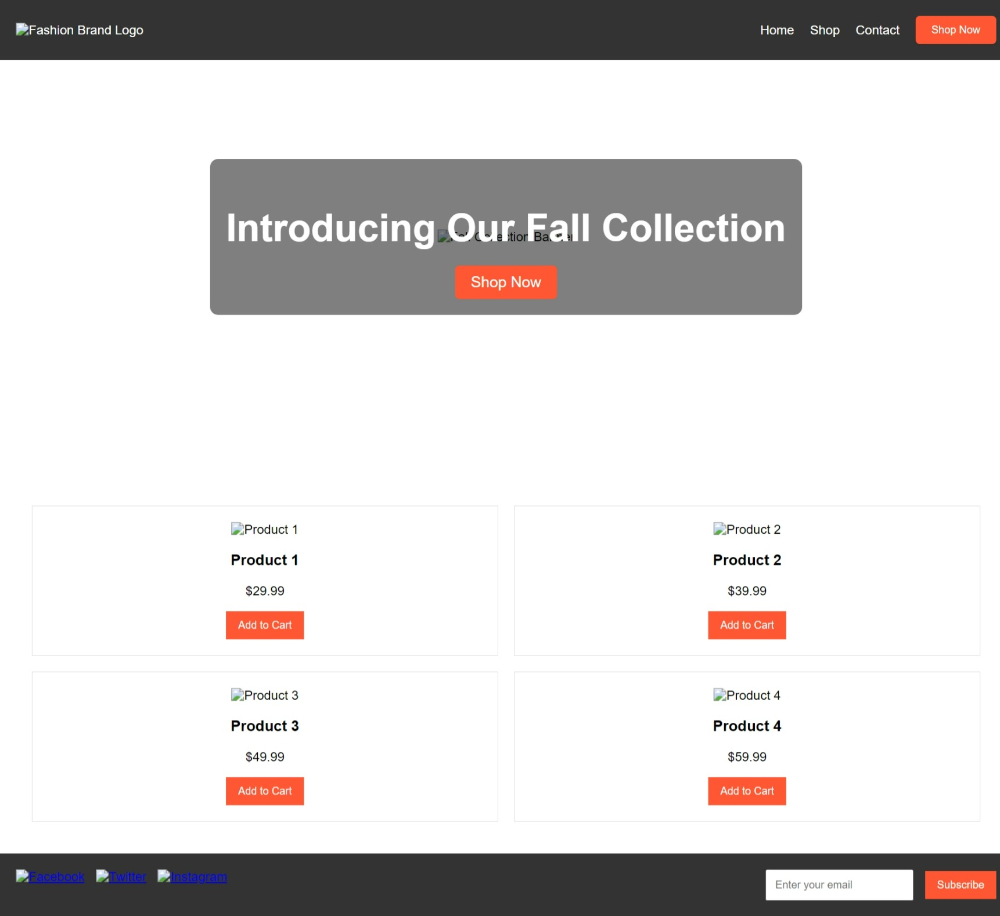

# TAC_Assesment
# Custom Landing Page for a Fashion Brand

## Project Overview
This project involves building a custom landing page for a fictional fashion brand that is launching a new product line. The landing page is designed to be visually appealing, responsive, and functional, using core web technologies: **HTML**, **CSS**, and **JavaScript**.

The page includes the following key sections:
- **Header**: A fixed header with the brand's logo, navigation links (Home, Shop, Contact), and a prominent "Shop Now" button.
- **Hero Section**: A full-width banner image with the text "Introducing Our Fall Collection" and a centered "Shop Now" button.
- **Product Grid Section**: A 2x2 grid showcasing four featured products, each with an image, name, price, and "Add to Cart" button.
- **Footer**: Social media links and a newsletter subscription form with an email input and "Subscribe" button.

### Functionality
- **Add to Cart Notification**: Displays an "Item added to cart!" alert when a product is added.
- **Responsive Design**: The page is fully responsive and adapts to mobile, tablet, and desktop screen sizes.

### Technologies Used
- **HTML5**: For structuring the landing page content.
- **CSS3**: For styling and ensuring the page is responsive using Flexbox and Grid.
- **JavaScript**: For handling interactions such as the "Add to Cart" notification.

## How to Run the Project
1. Clone the repository or download the project files.
2. Open the `index.html` file in a web browser.
3. Ensure you have a local web server running for the best performance with external assets (optional).

### GitHub Repository
You can view the source code and project files on GitHub:  
[GitHub Repository](https://github.com/nitikbisht/TAC_Assesment)

### Zipped Project Folder
Download the complete zipped folder of the project here:  
[Zipped Project Folder](https://drive.google.com/file/d/1C5FN1jgLWeM78PhGoXG2_zwRZDbKlmBB/view?usp=drive_link)

### Screenshots
Here are some screenshots of the project:

1. **Laptop View**
   

2. **Tablet View**
   

3. **Mobile View**
   

### Instructions to Run the Project
1. Download the zipped folder and extract it.
2. Open the `index.html` file in your preferred browser.
